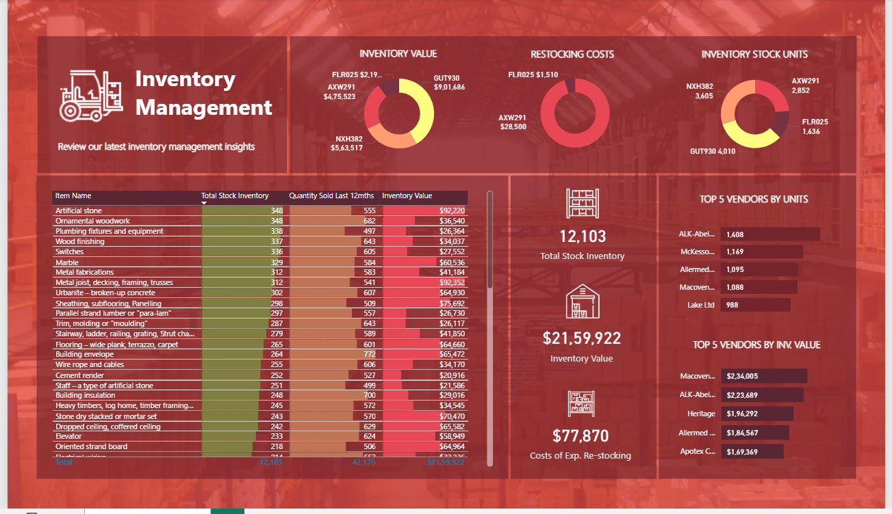

# 📊 Inventory Management Report (Power BI)

## 📌 Overview

This Power BI report analyzes inventory stock, vendor performance, and restocking costs.

## 🖼 Preview

## 📊 Insights

* Total Stock: 12,103
* Inventory Value: $2.15M+
* Restocking Cost: $77K

## 🛠 Tools Used

* Power BI
* DAX

## 🚀 How to Use

Download the `.pbix` file and open in Power BI Desktop
